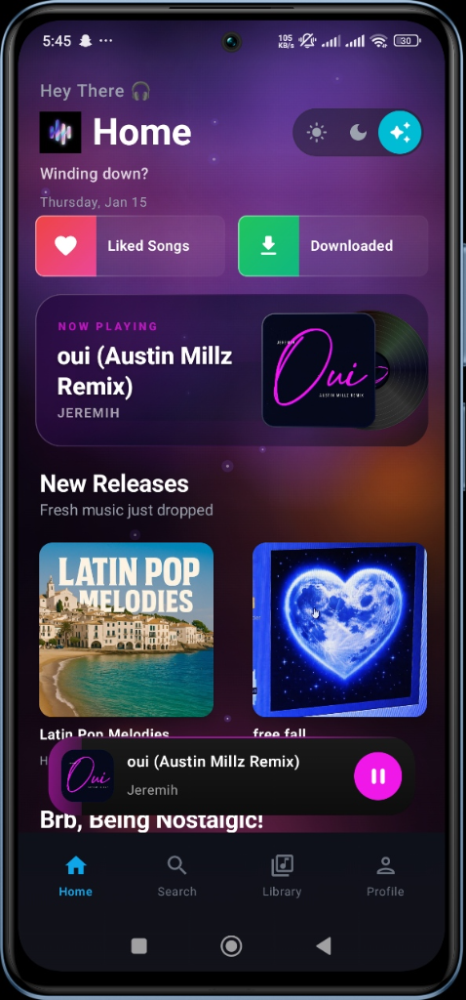
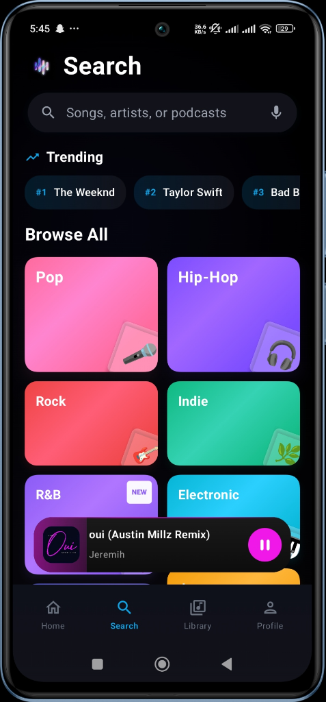
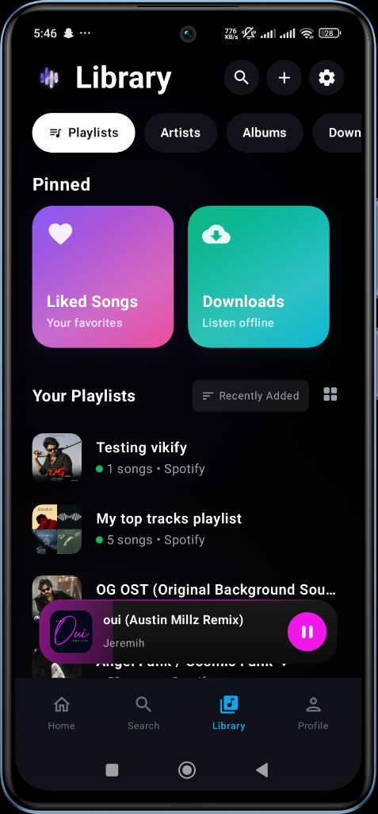

<p align="center">
  
</p>

<h1 align="center">🎵 Vikify</h1>

<p align="center">
  <strong>A Modern, Premium Music Player for Android</strong>
</p>

<p align="center">
  <a href="#features">Features</a> •
  <a href="#screenshots">Screenshots</a> •
  <a href="#installation">Installation</a> •
  <a href="#building">Building</a> •
  <a href="#configuration">Configuration</a> •
  <a href="#license">License</a>
</p>

---

## ✨ Features

### 🎧 Hybrid Music Library
- Stream from YouTube Music catalog
- Import Spotify playlists seamlessly
- Local file support with metadata editing
- Unified library experience

### 🔄 Spotify Integration
- One-click playlist import
- Silent background migration
- Automatic track resolution

### 🎨 Premium UI/UX
- Material 3 design with dynamic theming
- Glassmorphic player interface
- Smooth animations and transitions
- Dark/Light mode support

### 📥 Offline Mode
- Download songs for offline listening
- Smart queue management
- Background downloads

### 🎤 Lyrics Support
- Synchronized lyrics display
- Multiple lyrics providers (LrcLib, Kugou)
- Lyrics search and editing

### 🔊 Audio Effects
- Built-in equalizer
- Audio normalization
- Skip silence feature

## 📸 Screenshots

<p align="center">
  
  
  
</p>

## 📦 Installation

### Requirements
- Android 7.0 (API 24) or higher
- ~100MB storage space

### Download
Download the latest APK from the [Releases](https://github.com/TheCraftsman1/vikify/releases) page.

## 🔨 Building

### Prerequisites
- Android Studio Hedgehog or newer
- JDK 21
- Android SDK 36

### Setup

1. **Clone the repository**
   ```bash
   git clone https://github.com/TheCraftsman1/vikify.git
   cd vikify
   ```

2. **Configure API keys**
   
   Copy the example configuration files:
   ```bash
   cp local.properties.example local.properties
   cp vikify/native/app/google-services.json.example vikify/native/app/google-services.json
   ```
   
   Edit `local.properties` with your API keys:
   ```properties
   sdk.dir=/path/to/your/Android/Sdk
   GOOGLE_API_KEY=your_google_api_key
   SPOTIFY_CLIENT_ID=your_spotify_client_id
   SPOTIFY_CLIENT_SECRET=your_spotify_client_secret
   ```

3. **Configure Firebase**
   
   - Create a Firebase project at [Firebase Console](https://console.firebase.google.com/)
   - Add an Android app with package name `com.vikify.app`
   - Download `google-services.json` and place it in `vikify/native/app/`

4. **Build the project**
   ```bash
   ./gradlew :vikify:native:app:assembleFullDebug
   ```

### Build Variants

| Variant | Description |
|---------|-------------|
| `core` | Standard version |
| `full` | Full-featured version with FFmpeg support |

## ⚙️ Configuration

### Required API Keys

| Key | Purpose | Where to get |
|-----|---------|--------------|
| `GOOGLE_API_KEY` | YouTube playback | [Google Cloud Console](https://console.cloud.google.com/apis/credentials) |
| `SPOTIFY_CLIENT_ID` | Spotify integration | [Spotify Developer Dashboard](https://developer.spotify.com/dashboard) |
| `SPOTIFY_CLIENT_SECRET` | Spotify integration | [Spotify Developer Dashboard](https://developer.spotify.com/dashboard) |

### Firebase Setup
Required for user authentication and cloud features:
- Firebase Authentication (Google Sign-In)
- Cloud Firestore (user data sync)
- Realtime Database (Jam mode)

## 🏗️ Project Structure

```
vikify/
├── native/
│   └── app/           # Main Android application
├── innertube/         # YouTube Music API client
├── kugou/             # Kugou lyrics provider
├── lrclib/            # LrcLib lyrics provider  
├── material-color-utilities/  # Dynamic theming
├── taglib/            # Audio metadata library
└── ffMetadataEx/      # FFmpeg metadata extraction
```

## 📄 License

This project is licensed under the GPL-3.0 License - see the [LICENSE](LICENSE) file for details.

## 🤝 Contributing

Contributions are welcome! Please feel free to submit a Pull Request.

## ⭐ Acknowledgments

- Built with [Jetpack Compose](https://developer.android.com/jetpack/compose)
- Media playback by [Media3/ExoPlayer](https://developer.android.com/media/media3)
- YouTube integration via [Innertube](https://github.com/z-huang/InnerTune)

---

<p align="center">
  Made with ❤️ by TheCraftsman1
</p>
